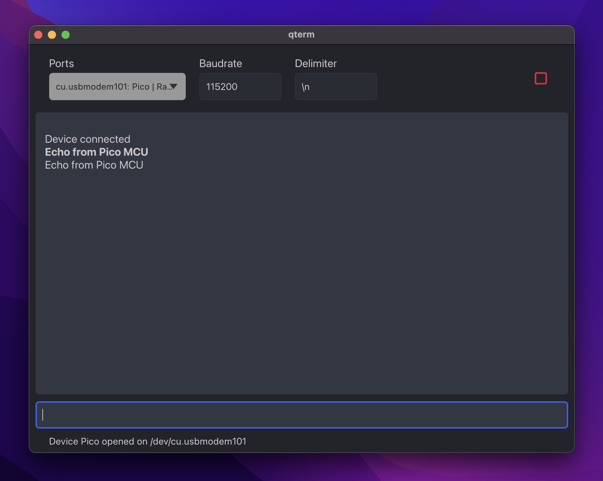

# qterm

QtQuick serial terminal application that (1) automatically detects attached devices, (2) displays both input and output
data, and (3) allows file drag-and-drop to transfer large amounts of data.



## Contents

- [Installation](#installation)
- [Packaging](#packaging)
- [Resources](#resources)

## Installation

Clone this repo:

```zsh
git clone git@github.com:lukasvasadi/qterm.git
```

Install `briefcase` inside a new virtual environment:

```zsh
pip install briefcase
```

Run application in `dev` mode (`briefcase` will automatically install dependencies):

```zsh
./dev.zsh
```

## Packaging

This application can be packaged as a standalone executable for distribution on Windows, macOS, and Linux. Follow the
instructions below or via the `briefcase` tutorials
from [BeeWare](https://docs.beeware.org/en/latest/tutorial/tutorial-3.html)
or [Qt](https://doc.qt.io/qtforpython/deployment-briefcase.html).

**Commands must be executed from the project parent directory.**

Create application scaffold:

```zsh
briefcase create
```

Build application:

```zsh
briefcase build
```

Test executable:

```zsh
briefcase run
```

Build installer:

```zsh
briefcase package --adhoc-sign
```

## Resources

### QtQuick development

- [Qml online textbook from the Qt Group](https://www.qt.io/product/qt6/qml-book)
- [Generating Qml from Figma](https://www.youtube.com/watch?v=DQi3ojkGi3g)

### UI dev tools

- [Font Awesome icon set](https://fontawesome.com/)

### Qt resource qrc files

Various file formats, e.g., icons, can be accessed via the [Qt Resource System](https://doc.qt.io/qt-5/resources.html).
To use these resources, follow the instructions from the
PySide [documentation on qrc files](https://doc.qt.io/qtforpython/tutorials/basictutorial/qrcfiles.html).

Whenever modifying the resources qrc file, run the following command to update the translated Python file (note: this
command part of the `dev` execution script):

```zsh
pyside6-rcc resources.qrc -o resources.py
```
